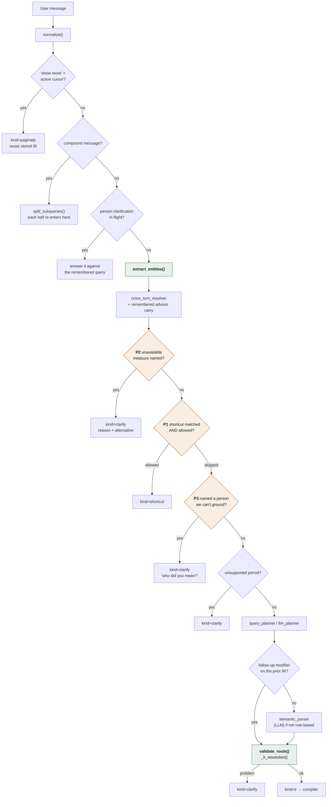

# Routing decision flow

How a user message becomes a route. Read this before changing anything in
`nlu_pipeline.resolve()` or `app/llm/routing.py`.

The governing rule is one sentence: **no component may make a routing
decision before the information that decision depends on exists.** All
three defects this pipeline was refactored to fix (P1/P2/P3) were the
same violation of it.

---

## The order



The green box is the change that matters. `extract_entities()` used to run
*after* the shortcut check; everything else follows from moving it up.

---

## The three gates

All three live in `app/llm/routing.py` as pure predicates — they read text
and the entity dict and return a decision. No database, no LLM, no
mutation, which is what makes routing reproducible and unit-testable.

### P2 — `unavailable_metric()`

Runs **first**, because availability is a property of the *metric*, not of
the query's shape.

Four measures are declared in `metric_aliases.UNAVAILABLE`: `connect %`,
`CR %`, `meetings %` (all three need a working-day calendar the sheets
don't carry) and `portfolio %` (no portfolio target exists to measure
against). Each declares a `reason` and an `instead`.

The old code reached that explanation only through the planner's
`clarify_metric` branch, which is reachable only when **no** person
resolved. So `"What is Ahmed's connect %?"` explained itself and
`"What is Ahmed Khan's connect %?"` returned a profile card — the
better-specified query got the worse answer.

The refusal still carries `plan.action == "clarify_metric"` so existing
consumers (the golden harness, the trace) can tell which clarification it
is. Moving *when* it fires must not change *what* it looks like.

### P1 — `shortcut_allowed()`

Shortcuts are a **fallback**, never the primary route.

`classify_intent()` now receives the real entity dict. It used to be handed
a hardcoded `{}` from the only production call site, which made its own
`entities.get("team")` guard dead code.

A shortcut may claim a message only when nothing better can. Two signals
mean something better exists:

| Signal | Why it outranks the shortcut |
|---|---|
| a resolved advisor (`advisor_wids`) | the question is about a specific person; the canned handler can't scope to one |
| an explicit rate/percentage phrase | the canned handler answers with a status sweep and cannot express a rate |

The second test reads the **matched alias phrase**, not the raw text.
Gating on "did any metric resolve" would break every generic sweep,
because the bare word `attendance` is itself an `attendance_rate` synonym
— `intent_detector`'s own docstring documents that trap.

Consequence: `attendance_rate` and `login_rate` are reachable again. Both
were fully bound and computing correctly the entire time they were
unreachable, which is why no numeric test ever caught it.

### P3 — `unresolved_subject()`

"The user named no subject" and "the user named a subject we failed to
resolve" are different, and `metric_def.primary_level` was applied to
both. For `achievement_pct` and `one_unit_ratio` — the only two metrics
declaring `primary_level="team"` — that meant `"What is Ahmed's
achievement %?"` answered about Blue Area without saying the subject had
changed.

The detector is a capitalised possessive (`Ahmed's`, `Zainab Malik's`)
that identity resolution did not ground. Deliberately narrow, because it
decides whether to ask a question, and asking one when the user named
nobody would be worse than the defect. Three guards keep it that way:

1. **A measure must be named.** The defect is a metric question answered
   at the wrong level; a query naming no metric can't hit it. This keeps
   `"Adeel Dogar's advisors"` (a roster request) out.
2. **A relation reference disqualifies it.** `"show Adeel Dogar's team"`
   is a hierarchy traversal, and managers are deliberately *not* in the
   advisor gazetteer — they're grounded later against the manager
   columns. `reference_parser` already owns that pattern, so it's asked
   rather than re-implemented. Skipping this broke five real tests.
3. **Known non-persons are excluded** — grounded groups, hierarchy level
   words, metric names — checked against the live registries rather than
   a hardcoded stop list.

---

## Subject level — who the question is about

Owned by [`app/llm/subject_level.py`](../backend/app/llm/subject_level.py).
Precedence, highest first:

| # | Signal | Example |
|---|---|---|
| 1 | explicit level **word** | "by team", "which advisor", "top 3 teams" |
| 2 | the grounded **entity's** level | "Downtown" → team, "Graana" → company |
| 3 | a resolved **relation** | "his team", "Ahmed's unit" |
| 4 | `metric.primary_level` | only when nothing above applies |

Tier 2 has one exception, which is the same rule read correctly rather
than a special case: when the query carries a **strong ranking signal**
the named group is a *scope*, not the subject. "Top 5 in Blue Area by
revenue" enumerates the people in Blue Area — ranking one team against
itself is not a question anyone asks — so the decision falls through to
the metric default.

Before Phase 2 the order was effectively `level_word → primary_level`,
and the grounded entity was demoted to a filter. That answered 12% of
queries at the wrong granularity:

```
"What is Downtown's pipeline value this month?"
  before: "Shehryar Abbasi has 3,500 ... 1st of 2 advisors shown"
  after:  "Downtown has 6,500 MTD Open Pipeline."
```

Four call sites decided this independently — `query_planner`'s
leaderboard scorer, `llm_planner._leaderboard_level`, `ir_validator`
(which *re-decided* it after the planner), and `query_ir`'s transfer.
Three consulted `primary_level` first, so fixing one left the others
wrong. `ir_validator` may now only **degrade** an unanswerable level, and
records that it did.

`Decision.rejected` carries every losing claimant and why it lost, so the
trace can answer "why this level?" without re-deriving it:

```
Level = team   [entity=team (chosen: the query's subject (Downtown) is a team)
                | metric_default=advisor lost: a subject was named, so the
                  metric's default does not apply]
```

## The validation gate

`validate_route()` is the last thing before the compiler, and every
`kind="ir"` exit passes through `_ir_resolution()` so a fourth exit added
later can't bypass it.

It deliberately re-checks **nothing**. A second copy of a rule that drifts
from the first is the defect this refactor exists to remove, so the gate
documents who owns each check instead:

| Check | Owner |
|---|---|
| advisor resolved | `unresolved_subject()`, then the planner's `clarify_person` branch |
| metric resolved | `ir_validator.validate_ir()` (also the confidence floor and fuzzy key recovery) |
| metric computable | `unavailable_metric()`, from the `UNAVAILABLE` registry |
| hierarchy valid | `QueryIR.subject_level` is a `Literal` over hierarchy's own level names — pydantic rejects an invalid level at construction |
| period valid | `query_compiler._effective_metric()` maps a requested period onto the metric's `period_family` and returns `None` when no member covers it; the response layer then explains in the period's own terms |

That leaves one invariant genuinely unowned, which is all the gate
enforces: `ir_validator`'s metric-key check runs only for
`leaderboard`/`comparison`/`filtered_list`, so an IR with any other intent
can carry a key that isn't in the ontology. The compiler would find no
binding and return an empty result, which reads to the user as "no data"
rather than "that isn't a measure I have".

> Two checks were written for this gate and then deleted: a period-family
> swap and a period-mismatch refusal. Both turned out to duplicate
> `_effective_metric()`, which already does the swap and already returns
> `None` for an uncoverable period. They are recorded here so the next
> person doesn't re-derive them.

---

## The routing trace

Always on, in memory, one per user message. `audit.decision()` already
recorded branch points but is gated on `AUDIT_ENABLED` and writes to a log
file — it can't be asserted against in a test. `routing.decide()` writes
to both sinks from one place, so a new decision can't land in one and be
missing from the other.

```python
from app.llm import routing
routing.current_trace().render()
```

```
Query = "What is Ahmed Khan's attendance percentage?"
  ↓
Shortcut = skipped   [entity extraction resolved 'Ahmed Khan' — a person-scoped
                      question belongs to the planner...]
  ↓
Advisor = Ahmed Khan (1.0)   [grounded by entity extraction]
  ↓
Planner = advisor_metric   [metric=attendance_rate level=advisor]
  ↓
Validation = passed   [metric, level and period are all answerable]
```

`trace.chose("Shortcut")` reads one decision without depending on the
trace's shape. Every step carries a `why`; a decision log that records
only the outcome can't tell you where a requirement was dropped, and
`test_every_routing_step_states_a_reason` enforces it.

---

## Adding a routing decision

1. Put the predicate in `routing.py`, pure and unit-testable.
2. Call it from `resolve()` **after** `extract_entities()` — if it needs
   information that doesn't exist yet, move the call, don't guess.
3. Record it with `routing.decide(stage, chose, why)`.
4. Add a regression test to `app/llm/test_routing.py` asserting the
   *decision*, not the rendered answer. Every defect fixed here was
   invisible at the metric layer.

## Known gap

`ir_patcher.try_patch()` still gates on `plan_action`, so a bare
follow-up like `"top 3"` after `"only Graana"` is declined and re-parsed
from scratch, losing the prior turn's filters. It is tracked by
`test_ir_patcher.py::test_follow_up_chain_patches_without_extra_llm_calls`
(red) and is the same class of defect as P1 — one signal serving two
semantics, here `plan.action` answering "what intent fits this text?" when
the patcher needs "is this text elliptical?". Out of scope for Phase 1.
